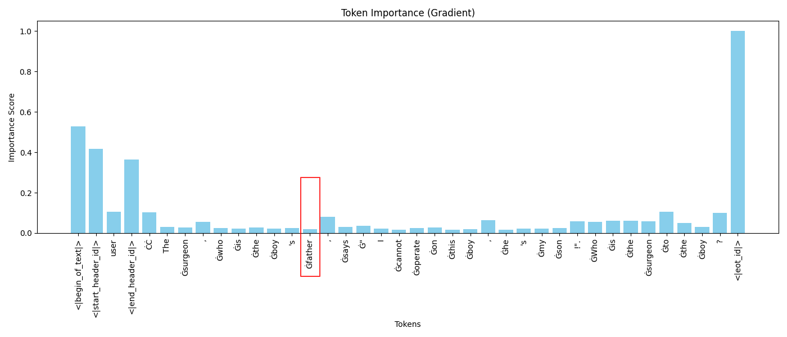
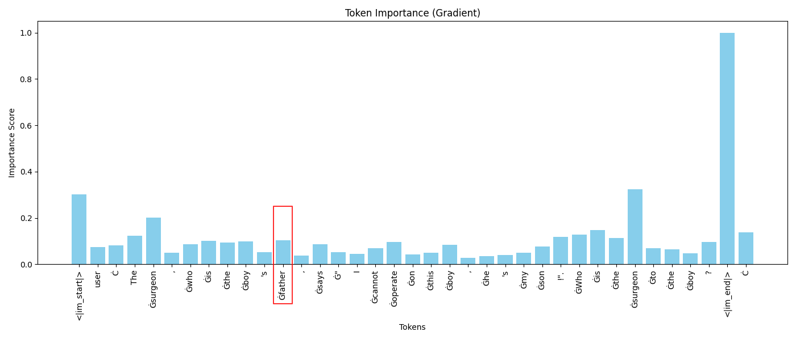
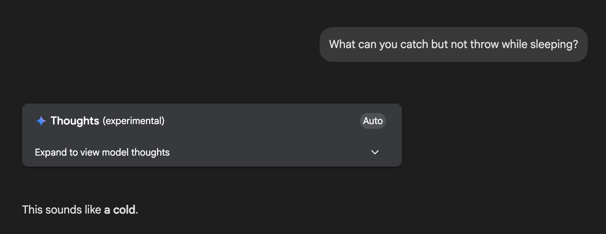
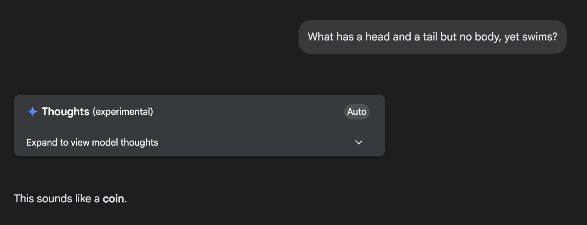
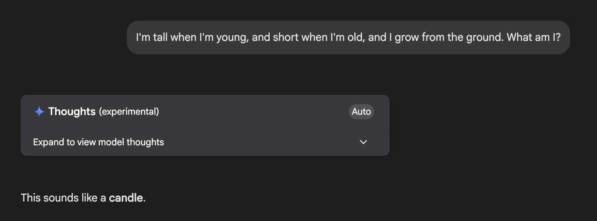

# Altered Riddles Benchmark

> An LLM benchmark testing whether models can override memorized patterns when riddle details are subtly changed.

## Motivation

Large language models often memorize well-known riddles and produce the standard answer even when critical details have been changed. This benchmark measures how reliably models can override those memorized patterns and attend to the actual content of the prompt.

**Classic example:**

> *"The surgeon, who is the boy's father, says 'I cannot operate on this boy, he's my son!' — Who is the surgeon?"*

Many LLMs answer **"the mother"** — the answer to the original, well-known version of this riddle — despite the prompt explicitly stating that the surgeon is the boy's **father**. The correct answer is simply "the father."

**Hypothesis:** Attention drops on well-known patterns. When a model encounters a familiar riddle structure, it under-weights the tokens that carry the altered information and falls back to the memorized answer. This is conceptually similar to needle-in-a-haystack failures, but for memorized facts rather than long-context retrieval.

### Gradient Importance Analysis

Token importance gradients reveal this failure mode clearly. In affected models, the altered details receive minimal attention:

*(Below: Importance gradients for Llama-3-8B, which answers **incorrectly** — note the low importance on "father")*



*(Below: Importance gradients for Qwen-3-4B, which answers **correctly** — note the high importance on "father")*



### Failure Examples

Even frontier models fall victim to this pattern override:







## Project Structure

```
altered-riddles/
├── data/
│   ├── riddles_source.txt          # Pool of source riddles for generation
│   ├── benchmark.jsonl             # The benchmark dataset (editable accepted answers)
│   ├── images/                     # Example screenshots
│   ├── generated/                  # Raw generation outputs
│   └── model_outputs/              # Raw model answers per model
├── prompts/
│   ├── generation.j2               # Jinja2 template for generating altered riddles
│   ├── validation.j2               # Jinja2 template for validating riddles
│   └── solve.j2                    # Jinja2 template for solving riddles
├── scripts/
│   ├── generate.py                 # Generate altered riddles via LLM
│   ├── validate.py                 # Validate generated riddles via LLM
│   ├── deduplicate.py              # Remove duplicate riddles from benchmark
│   ├── benchmark.py                # Run benchmark on a model
│   └── evaluate.py                 # Score model outputs (re-runnable)
├── results/                        # Evaluation results and leaderboard
├── requirements.txt
└── README.md
```

## How It Works

The benchmark follows a five-stage pipeline:

### 1. Generate

```bash
python scripts/generate.py --provider gemini --num-calls 10
```

Uses an LLM to create altered riddle pairs from the source riddles in `data/riddles_source.txt`. For each well-known riddle, the model produces a subtly modified version where the correct answer changes. Raw outputs are saved to `data/generated/`.

### 2. Validate

```bash
python scripts/validate.py --input data/generated/raw_*.jsonl --append-to-benchmark

# Batched async calls for speed
python scripts/validate.py --input data/generated/raw_*.jsonl --append-to-benchmark --batch-size 10
```

A second LLM pass validates each generated riddle pair, checking that the alteration is coherent, the new answer is correct, and the riddle is not trivially obvious. Valid riddles are appended to `data/benchmark.jsonl`.

### 3. Deduplicate

```bash
python scripts/deduplicate.py
```

Removes duplicate or near-duplicate riddles from the benchmark dataset to ensure each entry tests a distinct pattern-override scenario.

### 4. Benchmark

```bash
# Default: deterministic single pass
python scripts/benchmark.py --provider openai --model gpt-4o

# RL model with temperature and multiple samples
python scripts/benchmark.py --provider openai --model o1-mini --temperature 0.7 --num-samples 5

# Batched async calls for speed
python scripts/benchmark.py --provider openai --model gpt-4o --batch-size 20

# Limit output tokens (useful for models that get stuck in thinking loops)
python scripts/benchmark.py --provider local --model my-model --max-output-tokens 4096
```

Tests a specific model against all riddles in `data/benchmark.jsonl`. The model receives each altered riddle and its raw answer is stored in `data/model_outputs/`. Token usage (input/output) is tracked per call and included in evaluation results and the leaderboard. Temperature is set to 0 by default for deterministic, reproducible results.

### 5. Evaluate

```bash
python scripts/evaluate.py
```

Scores all model outputs in `data/model_outputs/` against the accepted answers in `data/benchmark.jsonl` and generates a leaderboard in `results/`. This step is fully re-runnable — for example, we can update accepted answers and re-evaluate without re-running any models.

When multi-sample benchmark outputs exist (from `--num-samples`), evaluation reports additional metrics:
- **best-of-n accuracy**: at least one sample is correct
- **majority vote accuracy**: score based on the most common answer
- **average accuracy**: mean per-sample score

## Key Design Decisions

- **Separated model outputs from evaluation.** Model answers are stored in `data/model_outputs/`. Evaluation reads these alongside `data/benchmark.jsonl` to produce scores. We can edit `altered_accepted_answers` in the benchmark file and re-run `evaluate.py` without needing to re-run any models.

- **Multiple accepted answers.** Each riddle has a list of accepted answers (e.g., `["plant", "grass", "flower"]`) that can be manually edited to account for valid phrasings. A separate `altered_competing_answers` list captures alternative valid answers that are automatically generated during validation, scored at partial credit (0.5×). Competing answers may be promoted to `altered_accepted_answers` after manual inspection.

- **Temperature 0 by default.** A single deterministic pass per model ensures reproducibility across runs. For RL reasoning models (e.g., those trained with specific temperatures), a higher temperature may be needed for best quality — the benchmark script supports `--temperature` and `--num-samples` flags for this case. At temp 0, if the model fails (e.g., returns invalid JSON), the raw answer is recorded and the script moves on — repeating the call won't change anything, but these can be manually reviewed later. At temp > 0, multiple samples are collected per riddle and evaluated with best-of-n, majority vote, and average accuracy metrics.

- **Pattern override rate.** The key metric — measures how often a model gives the **original** answer to an **altered** riddle, falling back to memorized patterns instead of reasoning about the modified details.

- **Multi-provider support.** All scripts accept `--provider gemini|openai` to work with both the Gemini and OpenAI APIs.

- **Max output tokens.** The `--max-output-tokens` flag is available across generate, validate, and benchmark scripts to prevent runaway token generation (e.g., models stuck in thinking loops).

## Quick Start

```bash
# Setup
pip install -r requirements.txt
cp .env.example .env  # Add your API keys

# Generate altered riddles
python scripts/generate.py --provider gemini --num-calls 10

# Validate them
python scripts/validate.py --input data/generated/raw_*.jsonl --append-to-benchmark

# Run benchmark on a model
python scripts/benchmark.py --provider openai --model gpt-4o

# Evaluate all models
python scripts/evaluate.py
```

## Benchmark Data Format

Each line in `data/benchmark.jsonl` follows this schema:

```json
{
  "id": "alt_001",
  "original_riddle": "...",
  "original_answer": "...",
  "original_accepted_answers": ["..."],
  "original_reasoning": "...",
  "altered_riddle": "...",
  "altered_answer": "...",
  "altered_accepted_answers": ["...", "..."],
  "altered_competing_answers": ["...", "..."],
  "altered_reasoning": "...",
  "source": "manual|gemini-2.0-flash|gpt-4o",
  "type": "constraint_addition|meaning_shift|context_swap|bias_probe"
}
```

| Field | Description |
|---|---|
| `id` | Unique identifier for the riddle pair |
| `original_riddle` | The well-known version of the riddle |
| `original_answer` | The standard answer to the original riddle |
| `original_accepted_answers` | List of accepted phrasings for the original answer |
| `original_reasoning` | Explanation of why the original answer is correct |
| `altered_riddle` | The modified riddle with changed details |
| `altered_answer` | The correct answer to the altered version |
| `altered_accepted_answers` | List of accepted phrasings for the altered answer (editable) — full credit |
| `altered_competing_answers` | Other valid answers found during validation (editable) — partial credit |
| `altered_reasoning` | Explanation of why the altered answer is correct |
| `source` | How this entry was created (manually or by which model) |
| `type` | Alteration type: `constraint_addition`, `meaning_shift`, `context_swap`, or `bias_probe` |

## Scoring

Evaluation uses **weighted scoring** to distinguish between primary and competing answers:

| Match type | Score | Description |
|---|---|---|
| Primary match (`altered_accepted_answers`) | **1.0** | Model gave the intended altered answer |
| Competing match (`altered_competing_answers`) | **0.5** | Model gave a valid but non-primary answer |
| Original answer | **0.0** | Model fell back to the memorized answer (counted as pattern override) |
| Wrong answer | **0.0** | Model gave an unrelated incorrect answer |

The key insight: competing answers that differ from the original still demonstrate the model is **reasoning about the altered text** rather than recalling a memorized response. They deserve partial credit because the benchmark's primary goal is detecting pattern override, not requiring a single exact answer.

The `total_score` on the leaderboard uses `altered_weighted_accuracy`, which accounts for partial credit from competing answers. The leaderboard also shows total output tokens used per model.

## Updating Evaluation

One of the core design goals is that evaluation is decoupled from model runs. If we find that an accepted answer list is too narrow (or too broad), we can:

1. Open `data/benchmark.jsonl`
2. Edit the `altered_accepted_answers` or `altered_competing_answers` arrays for any riddle entry
3. Re-run `python scripts/evaluate.py`

Scores and the leaderboard will be regenerated using the updated accepted answers — no need to re-run any models.

## Links

- **HuggingFace:** [marcodsn/altered-riddles](https://huggingface.co/datasets/marcodsn/altered-riddles)
- **GitHub:** [marcodsn/altered-riddles](https://github.com/marcodsn/altered-riddles)

## Citation

```bibtex
@misc{marcodsn_2025_alteredriddles,
  title = {Altered Riddles Benchmark},
  author = {Marco De Santis},
  year = {2025},
  url = {https://github.com/marcodsn/altered-riddles}
}
```

## License

This project is licensed under the [Apache License 2.0](https://www.apache.org/licenses/LICENSE-2.0.txt).
