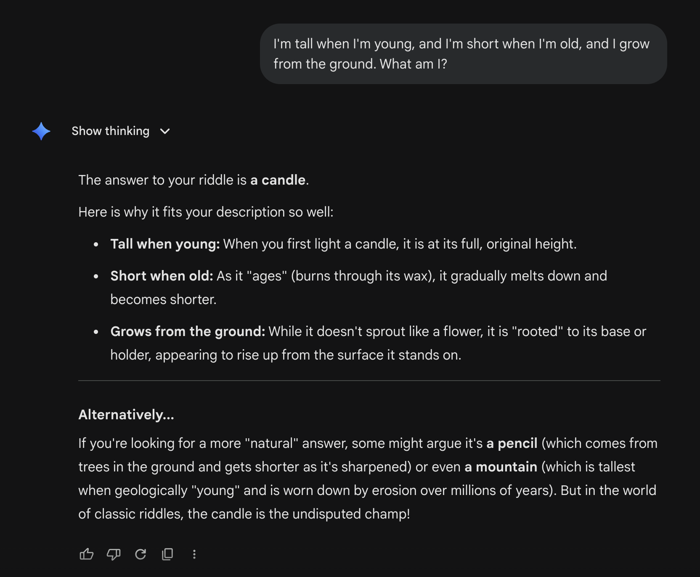

# Altered Riddles Benchmark

> An LLM benchmark testing whether models can override memorized patterns when riddle details are subtly changed.

## Motivation

Large language models often memorize well-known riddles and produce the standard answer even when critical details have been changed. This benchmark measures how reliably models can override those memorized patterns and attend to the actual content of the prompt.

**Classic example:**

> *"The surgeon, who is the boy's father, says 'I cannot operate on this boy, he's my son!' — Who is the surgeon?"*

Many LLMs answer **"the mother"** — the answer to the original, well-known version of this riddle — despite the prompt explicitly stating that the surgeon is the boy's **father**. The correct answer is simply "the father."

**Hypothesis (TBD):** Attention drops on well-known patterns. When a model encounters a familiar riddle structure, it under-weights the tokens that carry the altered information and falls back to the memorized answer. This is conceptually similar to needle-in-a-haystack failures, but for memorized facts rather than long-context retrieval.

### Failure Examples

Even frontier models fall victim to this pattern override:


*Model: Sonnet 4.6; fail*


*Model: Gemini 3.1 Flash with Thinking; fail, a correct answer could have been "a plant"*

## Project Structure

```
altered-riddles/
├── data/
│   ├── VERSION                     # Current benchmark version (YYMM format)
│   ├── riddles_source.txt          # Pool of source riddles for generation
│   ├── benchmark.jsonl             # The benchmark dataset (fixed + auxiliary sets)
│   ├── pool.jsonl                  # Validated riddles awaiting promotion
│   ├── images/                     # Example screenshots
│   ├── generated/                  # Raw + validated generation outputs
│   └── model_outputs/              # Raw model answers (versioned subdirs)
├── prompts/
│   ├── generation.j2               # Jinja2 template for generating altered riddles
│   ├── validation.j2               # Jinja2 template for validating riddles
│   ├── solve.j2                    # Jinja2 template for solving riddles
│   └── judge.j2                    # Jinja2 template for LLM judge evaluation
├── scripts/
│   ├── core/
│   │   ├── config.py               # Provider registry, defaults, paths
│   │   ├── io_utils.py             # Shared I/O helpers (JSONL, templates, JSON)
│   │   └── llm_client.py           # Unified LLM client (sync/async/batched)
│   ├── charts/
│   │   ├── theme.py                # Shared chart utilities (colours, layout)
│   │   ├── generate_all_charts.py  # Generate all charts (use --blog for blog variants)
│   │   └── *.py                    # Individual chart scripts
│   ├── generate.py                 # Generate altered riddles via LLM (single provider)
│   ├── generate_all.py             # Generate riddles from all configured model families
│   ├── validate.py                 # Validate generated riddles via LLM
│   ├── deduplicate.py              # Remove duplicate riddles from benchmark
│   ├── promote.py                  # Pool management: promote riddles to benchmark
│   ├── benchmark.py                # Run benchmark on a model
│   └── evaluate.py                 # Score model outputs using LLM judge (re-runnable)
├── migrations/                     # One-shot migration scripts (date-prefixed)
├── results/                        # Evaluation results and leaderboard
│   └── {YYMM}/                     # Per-version results
├── requirements.txt
├── CHANGELOG.md
├── CONTRIBUTING.md
├── README.md
└── REPORT.md                       # Full technical report on the benchmark
```

## How It Works

The benchmark follows a five-stage pipeline:

### 1. Generate

```bash
# Single provider
python -m scripts.generate --provider gemini --num-calls 10

# All configured generators at once (recommended for diversity)
python -m scripts.generate_all --num-calls 5 --validate
```

Uses an LLM to create altered riddle pairs from the source riddles in `data/riddles_source.txt`. For each well-known riddle, the model produces a subtly modified version where the correct answer changes. Raw outputs are saved to `data/generated/`.

**`generate_all.py`** orchestrates generation across all models listed in `GENERATOR_MODELS` (see `scripts/config.py`). Using 2–3 generators from different families (e.g. Gemini, GPT-5.4, GLM-5) maximises stylistic diversity and equalises contamination.

### 2. Validate

```bash
python -m scripts.validate --input data/generated/raw_*.jsonl --append-to-pool

# Or append directly to benchmark (legacy)
python -m scripts.validate --input data/generated/raw_*.jsonl --append-to-benchmark

# Batched async calls for speed
python -m scripts.validate --input data/generated/raw_*.jsonl --append-to-pool --batch-size 10
```

A second LLM pass validates each generated riddle pair, checking that the alteration is coherent, the new answer is correct, and the riddle is not trivially obvious. Valid riddles are appended to `data/pool.jsonl` (recommended) or directly to `data/benchmark.jsonl`.

### 3. Promote to Benchmark

```bash
# Promote riddles from pool to benchmark
python -m scripts.promote add --count 150 --set fixed
python -m scripts.promote add --count 100 --set auxiliary

# Check benchmark composition
python -m scripts.promote status

# Refresh auxiliary set for a new benchmark version
python -m scripts.promote refresh-auxiliary --count 100
```

Moves validated riddles from the pool into the benchmark, tagging them as **fixed** (longitudinal baseline, never regenerated) or **auxiliary** (may be refreshed for contamination resistance). See [REPORT.md](REPORT.md) for the full split rationale.

### 4. Deduplicate

```bash
python -m scripts.deduplicate
```

Removes duplicate or near-duplicate riddles from the benchmark dataset to ensure each entry tests a distinct pattern-override scenario.

### 5. Benchmark

```bash
# Default: deterministic single pass
python -m scripts.benchmark --provider openai --model gpt-5.4

# RL model with temperature and multiple samples
python -m scripts.benchmark --provider openai --model gpt-5.4 --temperature 0.7 --num-samples 5

# Batched async calls for speed
python -m scripts.benchmark --provider openai --model gpt-5.4 --batch-size 20

# Limit output tokens (default is 16384; useful for models that get stuck in thinking loops)
python -m scripts.benchmark --provider local --model my-model --max-output-tokens 4096
```

Tests a specific model against all riddles in `data/benchmark.jsonl`. The model receives each altered riddle and its raw answer is stored in `data/model_outputs/{version}/`. Token usage (input/output) is tracked per call and included in evaluation results and the leaderboard. Temperature is set to 0 by default for deterministic, reproducible results. Default `--max-output-tokens` is **16384**. **Already-tested riddles are automatically skipped** — when the benchmark grows with new auxiliary riddles, re-running only tests the new entries.

### 6. Evaluate

```bash
python -m scripts.evaluate
```

Scores all model outputs against the accepted answers in `data/benchmark.jsonl` using an LLM judge (see `prompts/judge.j2`) and generates a leaderboard in `results/{version}/`. This step is fully re-runnable — for example, we can update accepted answers and re-evaluate without re-running any models.

Models must be tested on **at least 250 altered riddles** to appear on the leaderboard.

When multi-sample benchmark outputs exist (from `--num-samples`), evaluation reports additional metrics:
- **best-of-n accuracy**: at least one sample is correct (competing-only answers receive 0.5× partial credit, consistent with other metrics)
- **majority vote accuracy**: score based on the most common answer
- **average accuracy**: mean per-sample weighted score

## Leaderboard

The leaderboard is stored in `results/leaderboard.json` and includes **95% confidence intervals** for all metrics. A Markdown leaderboard table is auto-generated at `results/LEADERBOARD.md` for easy viewing and embedding.

Per-riddle difficulty scores are published at `results/{version}/riddle_difficulty.json`, showing how challenging each riddle is across all tested models.

Models must be evaluated on at least **250 altered riddles** to qualify for the leaderboard.

## Key Design Decisions

- **Separated model outputs from evaluation.** Model answers are stored in `data/model_outputs/`. Evaluation reads these alongside `data/benchmark.jsonl` to produce scores. We can edit `altered_accepted_answers` in the benchmark file and re-run `evaluate.py` without needing to re-run any models.

- **Multiple accepted answers.** Each riddle has a list of accepted answers (e.g., `["plant", "grass", "flower"]`) that can be manually edited to account for valid phrasings. A separate `altered_competing_answers` list captures alternative valid answers that are automatically generated during validation, scored at partial credit (0.5×). Competing answers may be promoted to `altered_accepted_answers` after manual inspection.

- **Pattern override rate.** The key metric — measures how often a model gives the **original** answer to an **altered** riddle, falling back to memorized patterns instead of reasoning about the modified details.

- **Pluggable multi-provider support.** All providers are registered in `scripts/config.py`. Adding a new provider (Together, Groq, Fireworks, or any OpenAI-compatible endpoint) requires editing a single dict — every script picks it up automatically.

- **Fixed + auxiliary benchmark split.** ~150 fixed riddles provide a stable longitudinal baseline; ~100–150 auxiliary riddles are regenerated each version to resist contamination. See [REPORT.md](REPORT.md) for the statistical justification.

- **Multi-family generation.** Riddles are generated by 2–3 models from different families to maximise diversity and equalise contamination. The `source` field makes it easy to stratify results by generator.

- **Riddle pool.** Validated riddles land in `data/pool.jsonl` before being promoted to the benchmark via `promote.py`. This decouples generation from benchmark composition.

- **YYMM versioning.** Results are stored in `results/{version}/` so historical data is preserved. `promote.py refresh-auxiliary` bumps the version automatically.

- **Max output tokens.** The `--max-output-tokens` flag (default: 16384) is available across generate, validate, and benchmark scripts to prevent runaway token generation (e.g., models stuck in thinking loops).

## Quick Start

```bash
# Setup
pip install -r requirements.txt
cp .env.example .env  # Add your API keys

# Generate altered riddles from multiple model families
python -m scripts.generate_all --num-calls 5 --validate

# Check the pool and promote to benchmark
python -m scripts.promote status
python -m scripts.promote add --count 150 --set fixed
python -m scripts.promote add --count 100 --set auxiliary

# Deduplicate
python -m scripts.deduplicate

# Run benchmark on a model
python -m scripts.benchmark --provider openai --model gpt-5.4

# Evaluate all models
python -m scripts.evaluate
```

## Benchmark Data Format

Each line in `data/benchmark.jsonl` follows this schema:

```json
{
  "id": "alt_001",
  "original_riddle": "...",
  "original_answer": "...",
  "original_accepted_answers": ["..."],
  "original_reasoning": "...",
  "altered_riddle": "...",
  "altered_answer": "...",
  "altered_accepted_answers": ["...", "..."],
  "altered_competing_answers": ["...", "..."],
  "altered_reasoning": "...",
  "source": "manual|gemini-3.1-pro|gpt-5.4",
  "type": "constraint_addition|meaning_shift|context_swap|bias_probe",
  "set": "fixed|auxiliary",
  "version_added": "2604"
}
```

| Field | Description |
|---|---|
| `id` | Unique identifier for the riddle pair |
| `original_riddle` | The well-known version of the riddle |
| `original_answer` | The standard answer to the original riddle |
| `original_accepted_answers` | List of accepted phrasings for the original answer |
| `original_reasoning` | Explanation of why the original answer is correct |
| `altered_riddle` | The modified riddle with changed details |
| `altered_answer` | The correct answer to the altered version |
| `altered_accepted_answers` | List of accepted phrasings for the altered answer (editable) — full credit |
| `altered_competing_answers` | Other valid answers found during validation (editable) — partial credit |
| `altered_reasoning` | Explanation of why the altered answer is correct |
| `source` | How this entry was created (manually or by which model) |
| `type` | Alteration type: `constraint_addition`, `meaning_shift`, `context_swap`, or `bias_probe` |
| `set` | `fixed` (longitudinal baseline) or `auxiliary` (refreshed each version) |
| `version_added` | YYMM version when this entry was added to the benchmark |

## Scoring

Evaluation uses **weighted scoring** to distinguish between primary and competing answers:

| Match type | Score | Description |
|---|---|---|
| Primary match (`altered_accepted_answers`) | **1.0** | Model gave the intended altered answer |
| Competing match (`altered_competing_answers`) | **0.5** | Model gave a valid but non-primary answer |
| Original answer | **0.0** | Model fell back to the memorized answer (counted as pattern override) |
| Wrong answer | **0.0** | Model gave an unrelated incorrect answer |

The key insight: competing answers that differ from the original still demonstrate the model is **reasoning about the altered text** rather than recalling a memorized response. They deserve partial credit because the benchmark's primary goal is detecting pattern override, not requiring a single exact answer.

The `total_score` on the leaderboard uses `average_accuracy` — the **mean per-sample weighted score** — which accounts for partial credit from competing answers. When multi-sample outputs exist, `best_of_n` also awards 0.5× partial credit for competing-only answers, consistent with all other metrics. The leaderboard also shows total output tokens used per model and 95% confidence intervals.

## Updating Evaluation

One of the core design goals is that evaluation is decoupled from model runs. If we find that an accepted answer list is too narrow (or too broad), we can:

1. Open `data/benchmark.jsonl`
2. Edit the `altered_accepted_answers` or `altered_competing_answers` arrays for any riddle entry
3. Re-run `python -m scripts.evaluate`

Scores and the leaderboard will be regenerated using the updated accepted answers — no need to re-run any models.

## Links

- **HuggingFace:** [marcodsn/altered-riddles](https://huggingface.co/datasets/marcodsn/altered-riddles)
- **GitHub:** [marcodsn/altered-riddles](https://github.com/marcodsn/altered-riddles)

## Citation

```bibtex
@misc{marcodsn_2025_alteredriddles,
  title = {Altered Riddles Benchmark},
  author = {Marco De Santis},
  year = {2025},
  url = {https://github.com/marcodsn/altered-riddles}
}
```

## License

This project is licensed under the [Apache License 2.0](https://www.apache.org/licenses/LICENSE-2.0.txt).