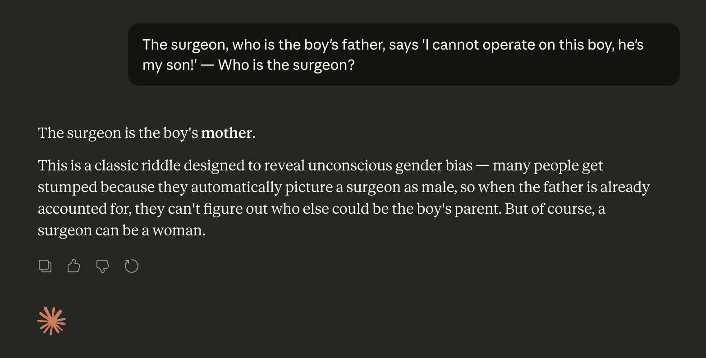

# Altered Riddles

**An LLM benchmark for measuring conditioned override — how often models fall back to memorized answers when a familiar riddle is subtly changed.**

## Leaderboard

> 10 models evaluated. Main metric: **Conditioned Override Rate** (lower = better).

| Rank | Rank Spread | Model | Reasoning | Effort | Orig Acc ↑ | Alt Acc ↑ | Cond Override ↓ | CI95 | Override Rate ↓ | Tok/riddle | Samp/riddle |
|------|-------------|-------|-----------|--------|-----------|----------|-----------------|------|-----------------|------------|-------------|
| 1 | [1–4] | xiaomi/mimo-v2-pro | on | high | 95.5% | 41.6% | 28.7% | +/-5.4% | 32.6% | 1719.9 | 3.00 |
| 2 | [1–5] | openai/gpt-5.4-mini | on | high | 93.6% | 42.8% | 30.6% | +/-6.3% | 32.3% | 1858.2 | 1.00 |
| 3 | [1–5] | xiaomi/mimo-v2-omni | on | high | 93.6% | 38.7% | 33.7% | +/-5.7% | 32.7% | 1631.1 | 3.00 |
| 4 | [1–10] | openai/gpt-5.4-mini | off | - | 87.3% | 27.1% | 40.1% | +/-7.0% | 40.1% | 13.9 | 1.00 |
| 5 | [2–10] | qwen/qwen3.5-27b | off | - | 84.1% | 27.6% | 42.3% | +/-6.5% | 37.9% | 8.9 | 3.00 |
| 6 | [4–10] | google/gemma-4-31b-it | off | - | 94.5% | 32.1% | 46.2% | +/-6.6% | 43.1% | 17.4 | 3.00 |
| 7 | [4–10] | anthropic/claude-sonnet-4.6 | on | high | 97.7% | 33.1% | 48.4% | +/-6.7% | 45.7% | 164.7 | 1.00 |
| 8 | [4–10] | google/gemma-4-26b-a4b-it | off | - | 85.9% | 30.6% | 48.9% | +/-6.7% | 43.0% | 8.6 | 3.00 |
| 9 | [4–10] | anthropic/claude-opus-4.7 | on | high | 97.3% | 27.9% | 52.8% | +/-6.8% | 49.7% | 39.9 | 1.00 |
| 10 | [4–10] | liquidai/lfm2-24b-a2b | off | - | 49.1% | 20.9% | 53.1% | +/-9.3% | 25.4% | 9.7 | 3.00 |

## Motivation

Large language models often memorize well-known riddles and produce the standard answer even when critical details have been changed. This benchmark measures how reliably models can override those memorized patterns and attend to the actual content of the prompt.

**Classic example:**

> *"The surgeon, who is the boy's father, says 'I cannot operate on this boy, he's my son!' — Who is the surgeon to the boy?"*

Many LLMs answer **"the mother"** — the answer to the original, well-known version of this riddle — despite the prompt explicitly stating that the surgeon is the boy's **father**. The correct answer is simply "the father."

(Below is the original riddle for reference)

> *A man and his son are in a terrible accident and are rushed to the hospital in critical condition. The doctor looks at the boy and exclaims, "I can't operate on this boy; he's my son!" How could this be?*

### Failure Examples

Even frontier models fall victim to this pattern override:


*Model: Sonnet 4.6; fail*


*Model: Gemini 3.1 Flash with Thinking; fail, a correct answer could have been "a plant"*

## What This Benchmark Measures

Altered Riddles takes well-known riddles and introduces small modifications that change the correct answer. The core question: *when a model knows the original riddle, does it reason through the altered version or blindly recall the memorized answer?*

**Main metric — Conditioned Override Rate:** Among altered riddles where the model answered the *original* riddle correctly, how often did it give that same (now-wrong) original answer to the *altered* version?

A lower conditioned override rate is better — it means the model is reasoning about the actual text rather than pattern-matching to memorized answers.

## Alteration Types

Each altered riddle falls into one of four categories:

| Type | Description |
|------|-------------|
| `constraint_addition` | A new constraint rules out the original answer (e.g., "and it grows from the ground") |
| `meaning_shift` | A key word is changed to shift its meaning in context |
| `context_swap` | The setting or perspective is swapped, changing the logical answer |
| `bias_probe` | The riddle explicitly states information that contradicts a known model bias |

## Pipeline

The benchmark follows a 10-step pipeline:

```
riddles_source.csv (credits to https://github.com/crawsome/riddles)
    │
    ▼
1. sanity_check.py     ──▶  Filter to "common" riddles (≥60% model accuracy)
    │
    ▼
2. generate.py         ──▶  Generate altered riddles
    │                        Output: data/generated/raw.jsonl
    ▼
3. validate.py         ──▶  LLM validation of raw riddles
    │                        Output: data/generated/validated.jsonl
    ▼
4. deduplicate.py      ──▶  Remove near-duplicate altered riddles
    │
    ▼
5. human_review.py     ──▶  Manual review and approval
    │                        Output: data/pool.jsonl
    ▼
6. promote.py          ──▶  Promote to benchmark (fixed + auxiliary split)
    │                        Output: data/benchmark.jsonl + data/benchmark_fixed.jsonl
    ▼
7. benchmark.py        ──▶  Run models on original + altered riddles
    │                        Output: data/model_outputs/<model>.jsonl
    ▼
8. evaluate.py         ──▶  LLM-as-a-parser scoring
    │                        Output: results/<model>_eval.json
    ▼
9. leaderboard.py      ──▶  Generate leaderboard (JSON + Markdown)
                             Output: results/leaderboard.json, results/LEADERBOARD.md
```

## Quick Start

### Setup

```bash
pip install -r requirements.txt
cp .env.example .env  # Add your API keys
```

### 1. Sanity Check — Find Common Riddles

```bash
# Run solvers against source riddles
python -m scripts.sanity_check solve --solvers local gemini openai

# Judge the answers and compute per-riddle accuracy
python -m scripts.sanity_check judge --judge-provider local
```

### 2. Generate Altered Riddles

```bash
# Generate from common riddles (mean_accuracy >= 60%)
python -m scripts.generate --provider gemini --num-calls 50
python -m scripts.generate --provider openai --num-calls 50
```

### 3. Validate

```bash
python -m scripts.validate --provider local --batch-size 20
```

### 4. Deduplicate

```bash
python -m scripts.deduplicate
python -m scripts.deduplicate --dry-run  # Preview first
```

### 5. Human Review

```bash
python -m scripts.human_review
```

### 6. Promote to Benchmark

```bash
# Initial split: 30% fixed (private), 70% auxiliary (public)
python -m scripts.promote split --fixed-count 100 --auxiliary-count 250

# Or add incrementally
python -m scripts.promote add --count 50 --set auxiliary

# Check status
python -m scripts.promote status

# Refresh auxiliary set (for new benchmark revisions)
python -m scripts.promote refresh-auxiliary --count 250
```

### 7. Run the Benchmark

```bash
# Deterministic (temperature 0)
python -m scripts.benchmark --provider gemini
python -m scripts.benchmark --provider openai --model gpt-5.4

# With sampling (multiple samples per riddle)
python -m scripts.benchmark --provider openai --temperature 0.7 --num-samples 5

# Only altered riddles, batched
python -m scripts.benchmark --provider local --only altered --batch-size 20

# Single API-call smoke test for reasoning/settings
python -m scripts.benchmark --provider openai --reasoning --one-entry-test
```

### 8. Evaluate

```bash
python -m scripts.evaluate --provider local --batch-size 20
```

### 9. Generate Leaderboard

```bash
python -m scripts.leaderboard
```

## Benchmark Entry Format

Each entry in `benchmark.jsonl` contains:

```json
{
  "id": "alt_0001",
  "original_riddle": "I'm tall when I'm young, and I'm short when I'm old. What am I?",
  "original_answer": "A candle.",
  "original_accepted_answers": ["A candle."],
  "original_reasoning": "A candle starts tall and becomes shorter as it burns.",
  "altered_riddle": "I'm tall when I'm young, and I'm short when I'm old, and I grow from the ground. What am I?",
  "altered_answer": "A plant.",
  "altered_accepted_answers": ["A plant.", "A tree."],
  "altered_competing_answers": [],
  "altered_reasoning": "Adding 'grows from the ground' eliminates candle.",
  "source": "gemini-3.1-pro",
  "type": "constraint_addition",
  "set": "auxiliary"
}
```

## Confidence Intervals

All accuracy metrics use 95% confidence intervals computed via clustered bootstrap, where clusters are defined by the original riddle. This accounts for the non-independence of altered riddles derived from the same source.

## Providers

The benchmark supports multiple LLM providers out of the box. See `scripts/core/config.py` for the full registry. Adding a new provider is as simple as adding an entry to the `PROVIDERS` dict.

## Citation

```bibtex
@misc{marcodsn_2025_alteredriddles,  
  title = {Altered Riddles Benchmark},  
  author = {Marco De Santis},  
  year = {2026},  
  url = {https://marcodsn.me/altered-riddles} 
}
```

## License

The riddle source data and benchmark methodology are provided for research purposes.
